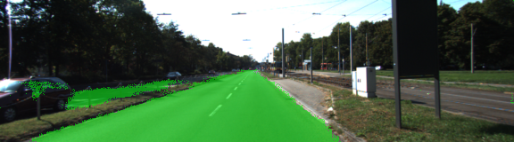
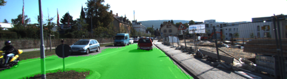
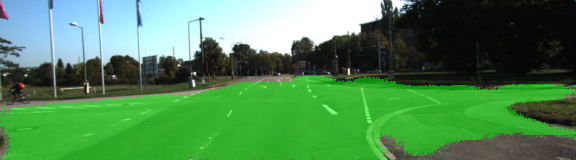
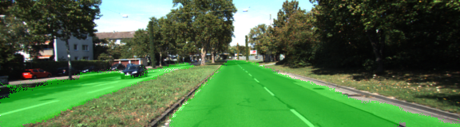
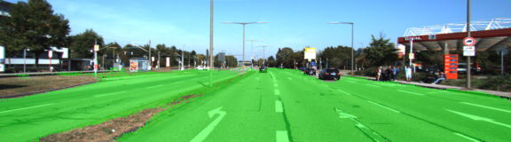
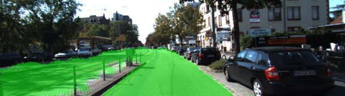
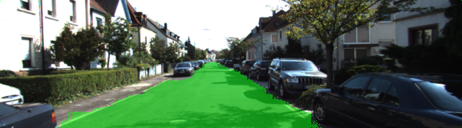

# Semantic Segmentation

## Introduction
In this project, you'll label the pixels of a road in images using a Fully Convolutional Network (FCN).

## Approach

### Architecture

A pre-trained VGG-16 network was converted to a fully convolutional network by converting the final fully connected layer to a 1x1 convolution and setting the depth equal to the number of desired classes. Performance is improved through the use of skip connections, performing 1x1 convolutions on previous VGG layers (in this case, layers 3 and 4) and adding them element-wise to upsampled lower-level layers.

### Optimizer

The loss function for the network is cross-entropy using Adam optimizer.

### Training

The hyperparameters used for training are:

  - keep_prob: 0.5
  - learning_rate: 0.00001
  - epochs: 48
  - batch_size: 5
 
 ### Samples











## Setup

### Frameworks and Packages
Make sure you have the following is installed:
 - [Python 3](https://www.python.org/)
 - [TensorFlow](https://www.tensorflow.org/)
 - [NumPy](http://www.numpy.org/)
 - [SciPy](https://www.scipy.org/)

### Dataset
Download the [Kitti Road dataset](http://www.cvlibs.net/datasets/kitti/eval_road.php) from [here](http://www.cvlibs.net/download.php?file=data_road.zip).  Extract the dataset in the `data` folder.  This will create the folder `data_road` with all the training a test images.

### Run
Run the following command to run the project:
```
python main.py
```
